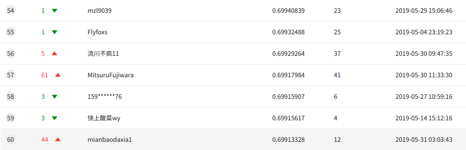
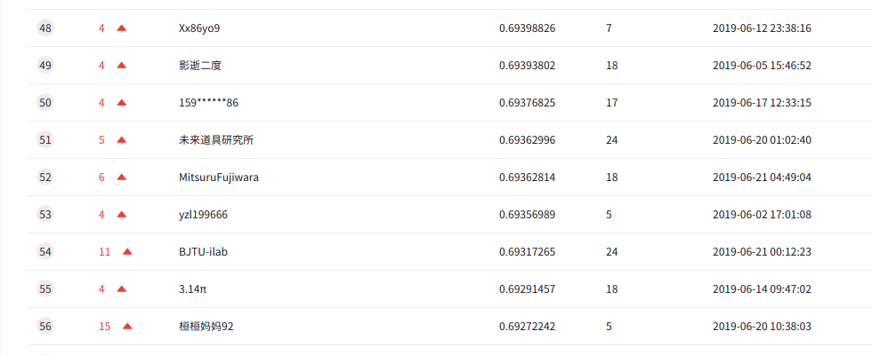

# KDD-Cup-2019
This repository is the 52nd place solution of [KDD Cup 2019 Regular ML track](https://dianshi.baidu.com/competition/29/rule)
(Context-Aware Multi-Modal Transportation Recommendation).
I ranked 57th place at phase1 and 52nd at phase2.
## Phase1
### Result
57th place of 1702 teams!
- LB score: 0.69917984
- Local cv: 0.678330

### Model Pipeline
Model Pipeline is as below.  
I used LightGBM and XGBoost  
See [phase1 final version](https://github.com/MitsuruFujiwara/KDD-Cup-2019/tree/7f538fd0785118cd6e8fd120023152872357023e) for details.
### Features

### Post Processing
## Phase2
### Result
52nd place of 100teams.
- LB score: 0.69362814
- Local cv: 0.657519

### Model Pipeline
In phase2,
### Features

### Post Processing

### Score
