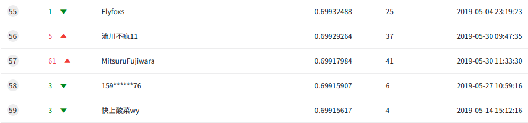
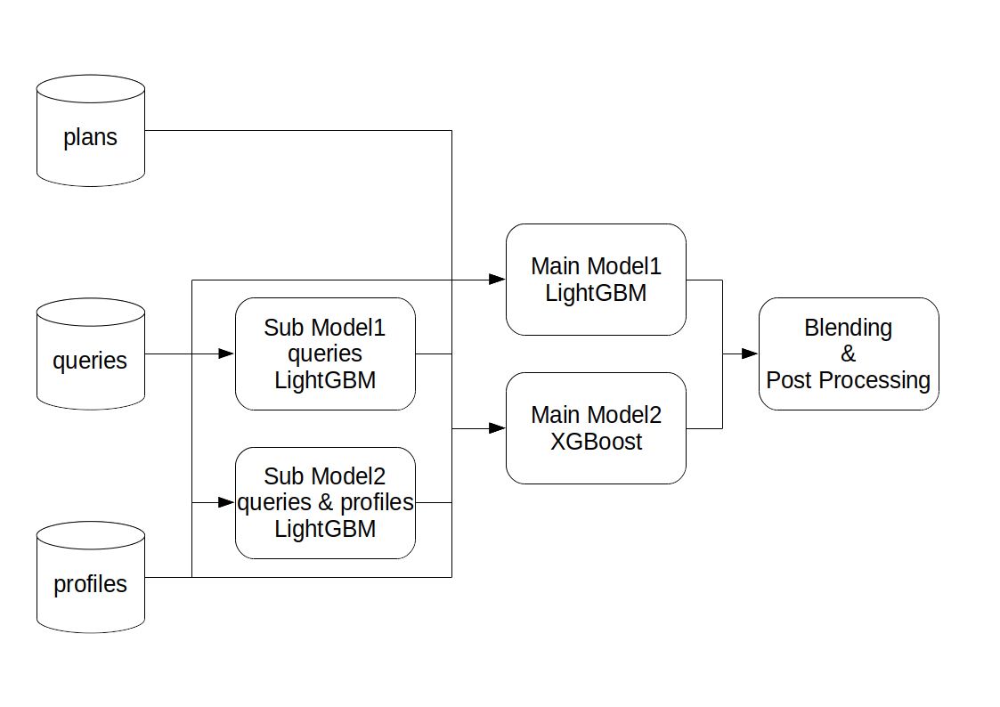
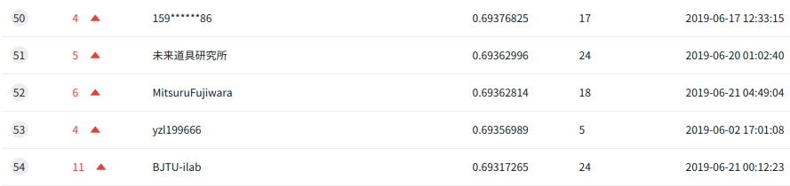
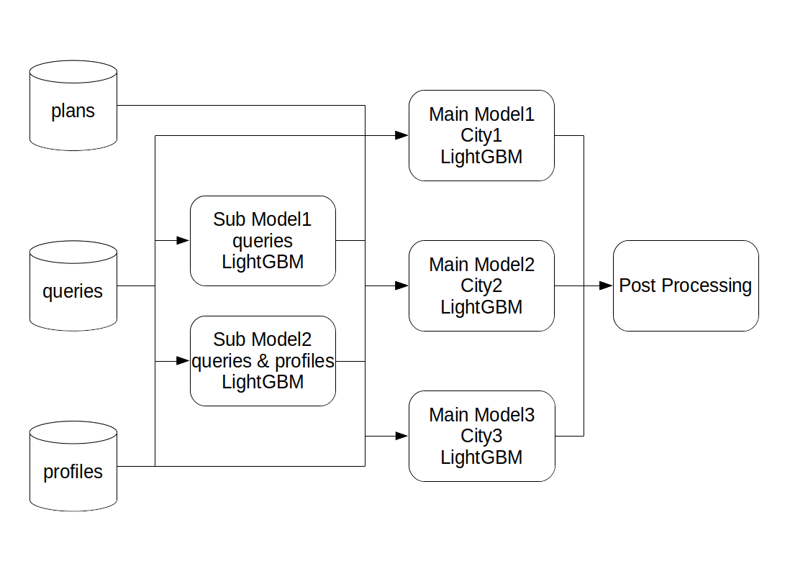

# KDD-Cup-2019  
 This repository is my solution of KDD Cup 2019 Regular ML track
(Context-Aware Multi-Modal Transportation Recommendation).
See [Competition Website](https://dianshi.baidu.com/competition/29/rule)
for the details.
In this competiton, I got the 57th place at phase1 and 52nd at phase2
(could not enter to phase3).
## Phase1
### Result
57th place of 1702 teams.
- LB score: 0.69917984
- Local cv score: 0.678330

### Model Pipeline

See [phase1 final version](https://github.com/MitsuruFujiwara/KDD-Cup-2019/tree/7f538fd0785118cd6e8fd120023152872357023e) for the details.

### Key Findings
- Features  
See [features I used](https://github.com/MitsuruFujiwara/KDD-Cup-2019/blob/7f538fd0785118cd6e8fd120023152872357023e/features/000_all_features.json).
The most important feature was plan_0_transport_mode.
In phase1, people clicks plan_0_transport_mode in about 60% of sessions (it means people likely to ckick a plan displayed on the top?).
I also used count & target encoded features for these categorical variables.
As a result, my best single model scored 0.6925 on LB.
- Sub Models  
I prepared two sub models, one trained by queries and the other by queries & profiles.
By adding their outputs to the main model's features, LB score improved from 0.6925 to 0.6945.
- Post Processing  
Post processing improved LB score from 0.6945 to 0.6991.
Some classes (0, 3, 4, 6) in out of fold predictions accounted for smaller percentage compared to that of train data.
So I adjusted predictions for these classes by constant multiples.
The multiples were dicided by maxmizing out of fold f1 score
(see [blending](https://github.com/MitsuruFujiwara/KDD-Cup-2019/blob/7f538fd0785118cd6e8fd120023152872357023e/src/201_blend.py#L67)).

## Phase2
### Result
52nd place of 100teams.
- LB score: 0.69362814
- Local cv score: 0.657519

### Model Pipeline

See [phase2 final version](https://github.com/MitsuruFujiwara/KDD-Cup-2019/tree/81ebff03dfa45323466a46511b6926777975d34a) for the details.

### Key Findings
- Splitting Model  
In phase2, there were 3 cities in dataset.
I splitted main model by cities since the distribution of transport mode were  quite diffirent.
After splitting model, LB score reached to 0.6900.
- Features  
Features were almost the same as that of phase1 but I did target encoding by every 3 cities.
- Post Processing  
The same post processing as phase1 applyed for class 0, 3, 4.
Finally the best LB score was 0.6936.
